# Table of Contents

1.) [Introduction](#introduction)  
2.) [How to Use](#howToUse)  
3.) [Tech Stack](#techStack)  
4.) [Application General Architecture](#generalArch)  
5.) [Express Overview](#expressOverview)  
6.) [Express Infrastructure](#expressInfrastructure)  
7.) [User Flow](#userFlow)  
8.) [User Login State](#userLoginState)  
9.) [General OAuth Flow](#OAuthFlow)  
10.) [Cookie Based OAuth](#cookieOAuthFlow)  
11.) [User Cookie Authentication](#userCookieAuth)  
12.) [Mailer Object](#mailerSetup)  
13.) [Handling Mailer Requests](#mailerReq)  

## Introduction
Mail Bulk is a boilerplate demo application created by me to practice complex full stack concepts such as:
* Learning the architectural considerations of building a full stack app  
* Connecting a front-end Create-React-App server to a NodeJS and Express backend  
* Communicate data from your Mongo database to a React application  
* Understand how to route user requests on the front end with React Router and on the backend with Express  
* Build reusable user inputs with Redux Form, complete with navigation  
* Handle credit cards and receive payments from your users with Stripe  
* Engage users with automated emails  
* Enhance authentication flows in an app with Google OAuth authentication  
* Separate production and development resources with advanced API key handling techniques  

## How to Use
1. Navigate to https://peaceful-plateau-53924.herokuapp.com/  
2. Click Google Sign in at top right  
3. Add credits (no real information needed)  
4. Use DEMO stripe information:  
   * email: any email (example@email.com works!)  
   * card number: 4242 4242 4242 4242  
   * date: any future MM/YY  
   * cvc: any 3 digit number  
5. Click red plus at bottom right to create survey  
6. Fill out survey form  

## Tech Stack

    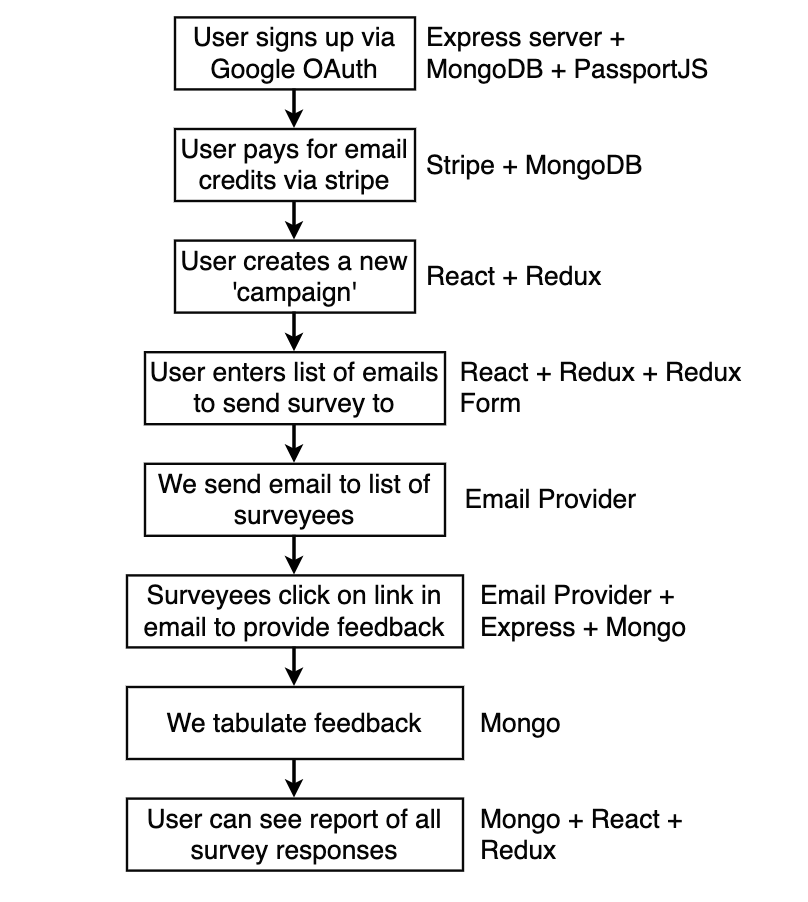

## Application General Architecture

    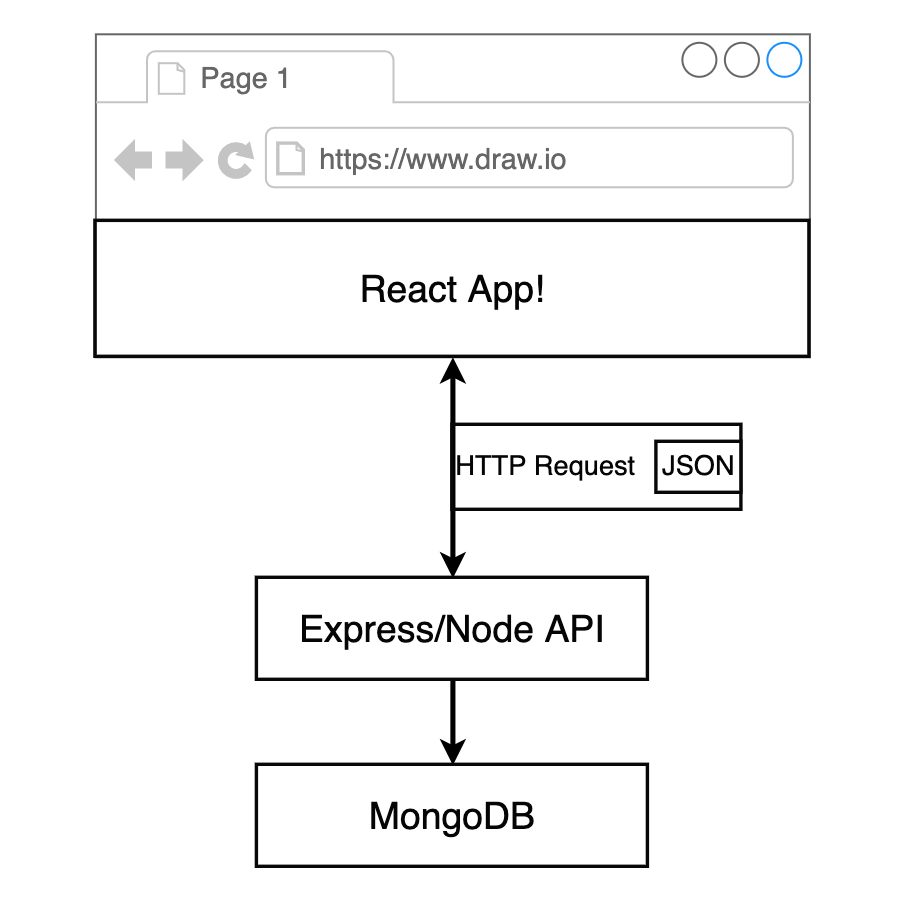

## Express Overview

    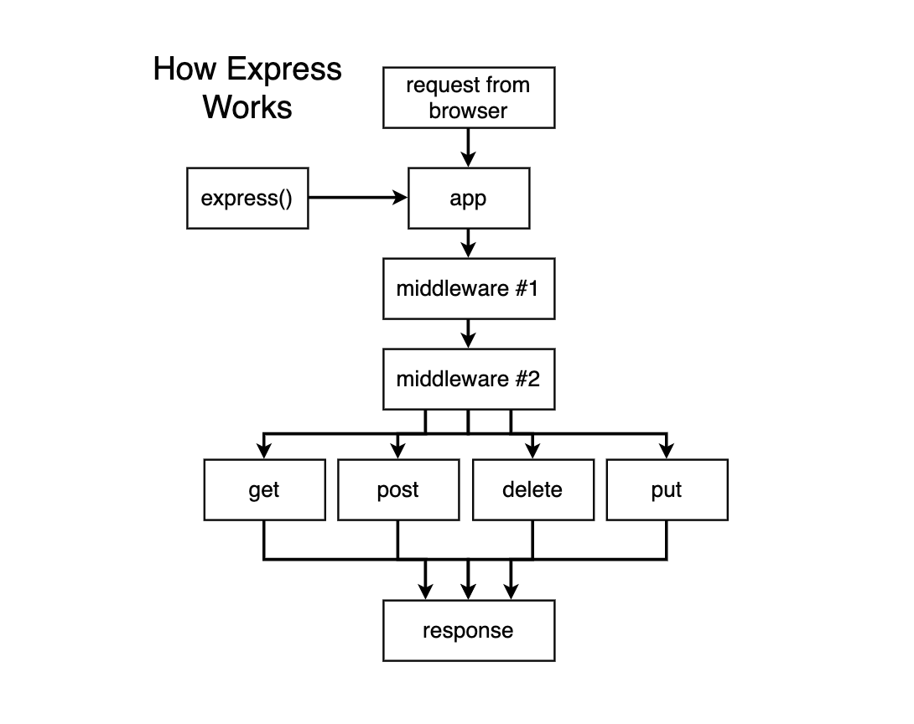

## Express Infrastructure

    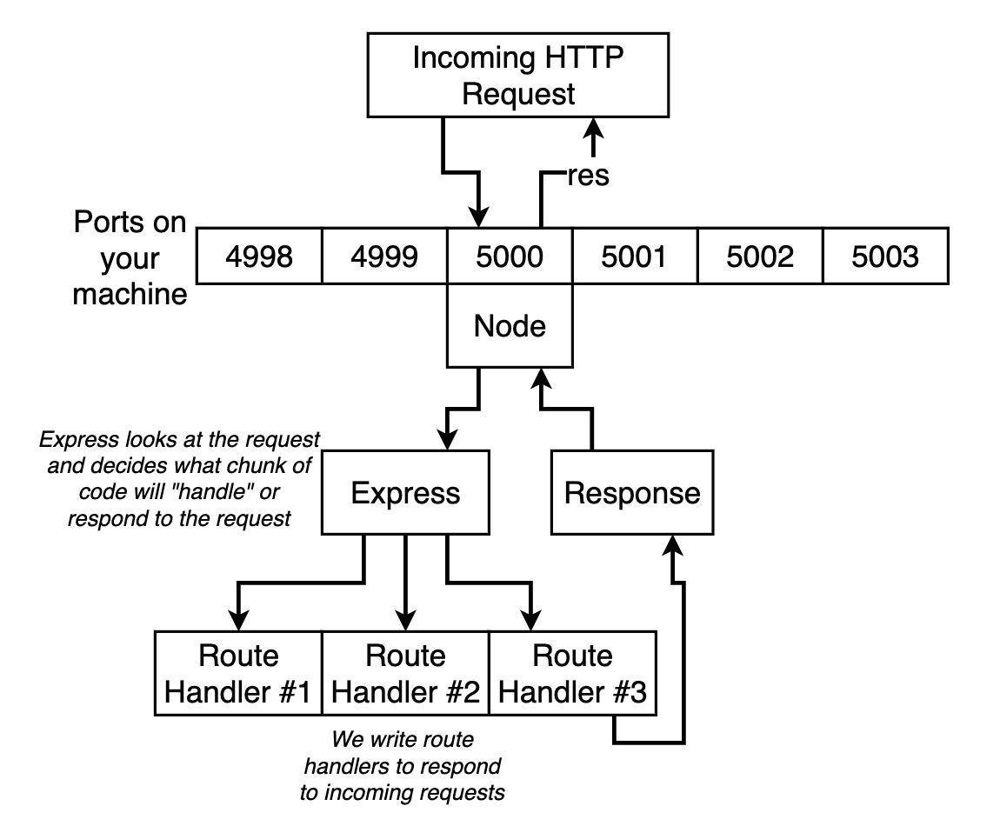

## User Flow

    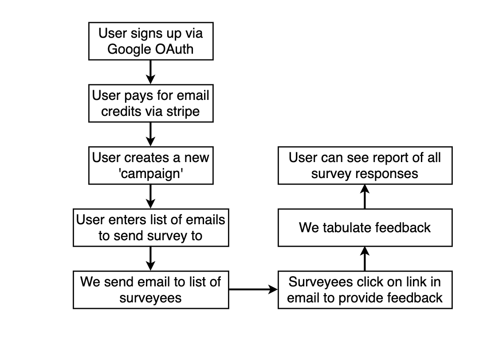

## User Login State

    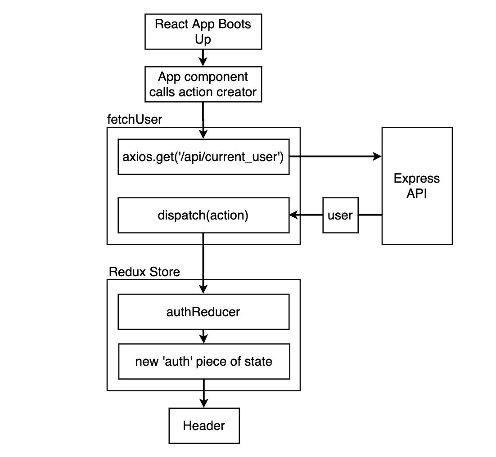

## General OAuth Flow

    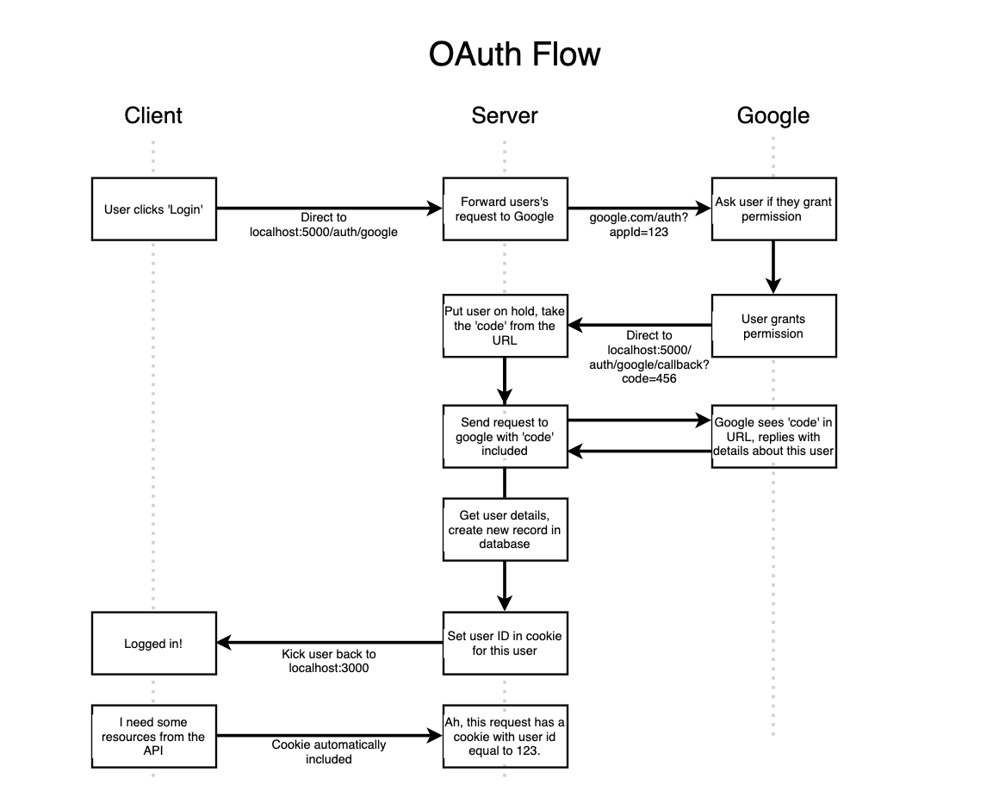

## Cookie Based OAuth

    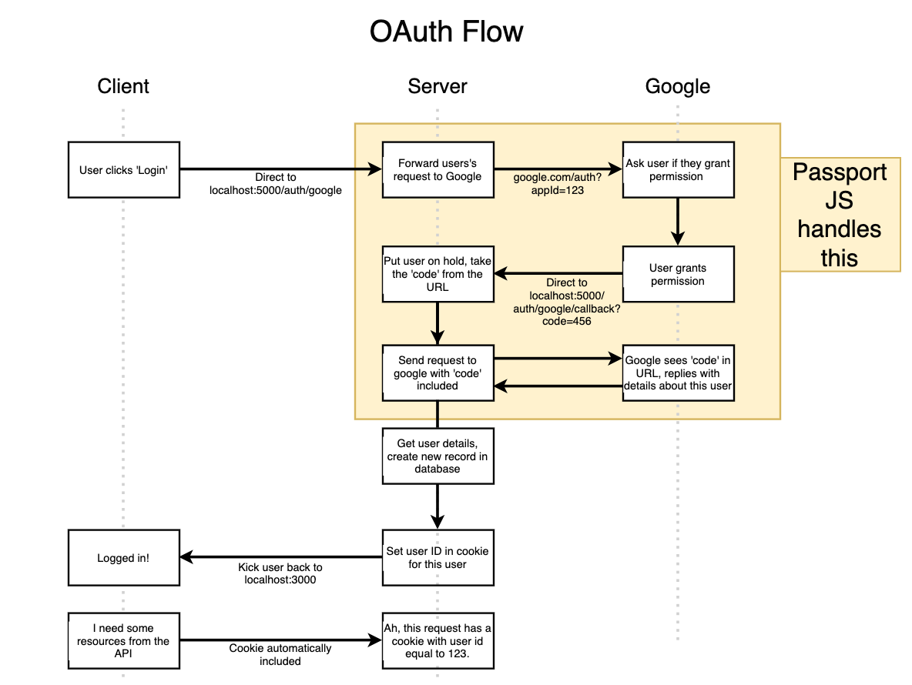

## User Cookie Authentication

    

## Mailer Object

    

      This picture represents a Mailer Object. Mailer object is created as a class. The properties of the object will be subject and recipients (which both come from our survey object). Next the body of the mailer comes from our email template which gets properties passed in from our survey object. Finally, the from_email property is the "from" address specified in an email. In order to set these properties we create a function to.JSON() to translate our mailer object into json data. Finally, we take the json and send it to SendGrid to author and send off the actual email.
    

    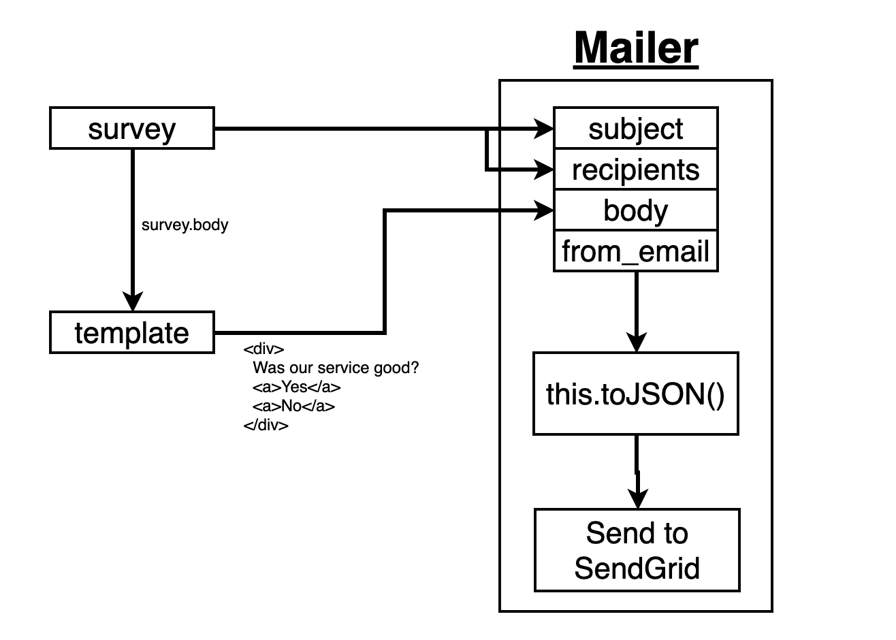

## Handling Mailer Requests

    In the approach illustrated below, we could create a seperate mailer object for every email recipient. This would overload requests for just a single survey. For example, if a user creates a survey for feedback from 1,000 recipients, then that request would create a seperate mailer for each recipient and communicate it to SendGrid in 1,000 seperate http requests. This would severly slow down our application. 

  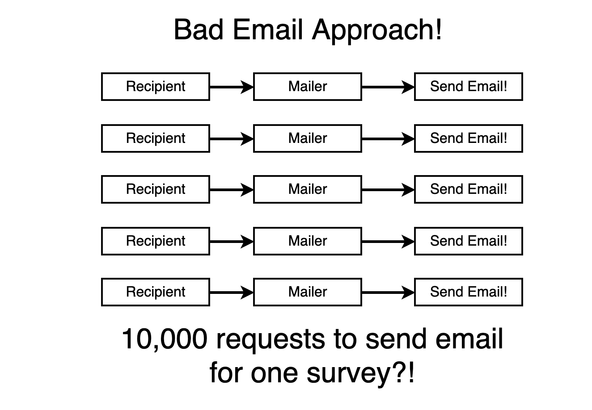

  Alternatively, we could do a batch operation by creating just one mailer object for all recipients. This would send an identical email template to all recipients. Since every recipient gets the same Mailer Object we need to identify unique users so our data is not manipulated. This is where SendGrid comes into play. SendGrid allocates their own metrics by using the links provided in the email. So if a user clicks the "no" link, they are sent to a SendGrid server to allocate metric data, before being routed to the "no" links destination. SendGrid then sends a messege to our server telling us about a user clicking a link. We use the 'token' provided by SendGrid in the messege to differentiate unique users. 

  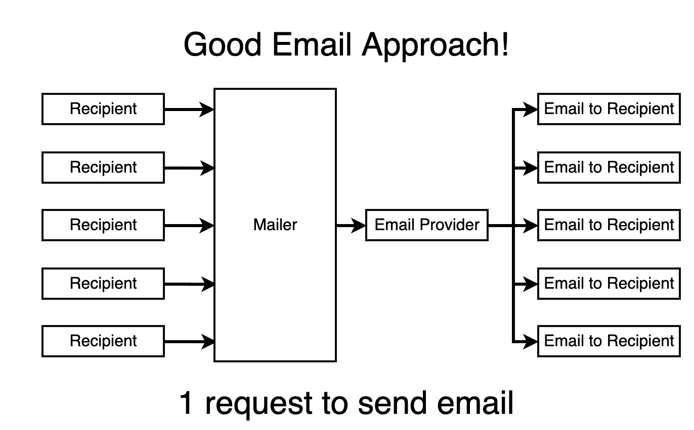

